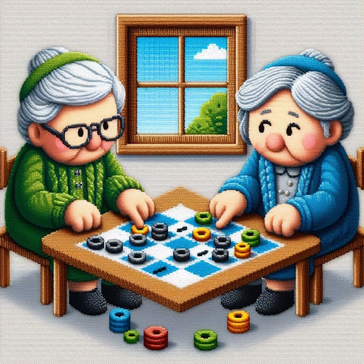
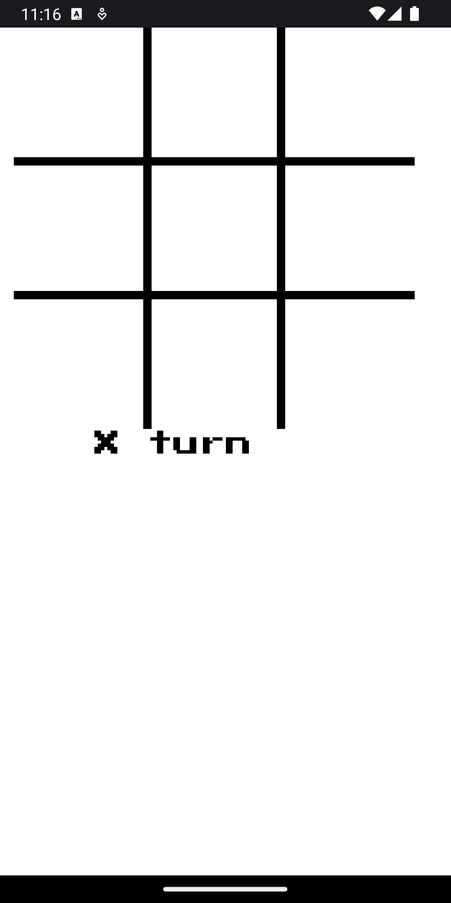
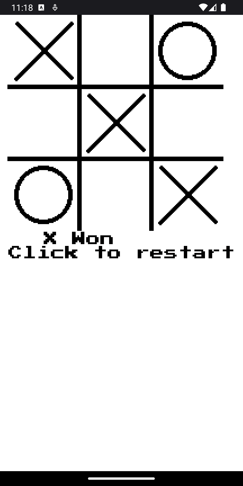
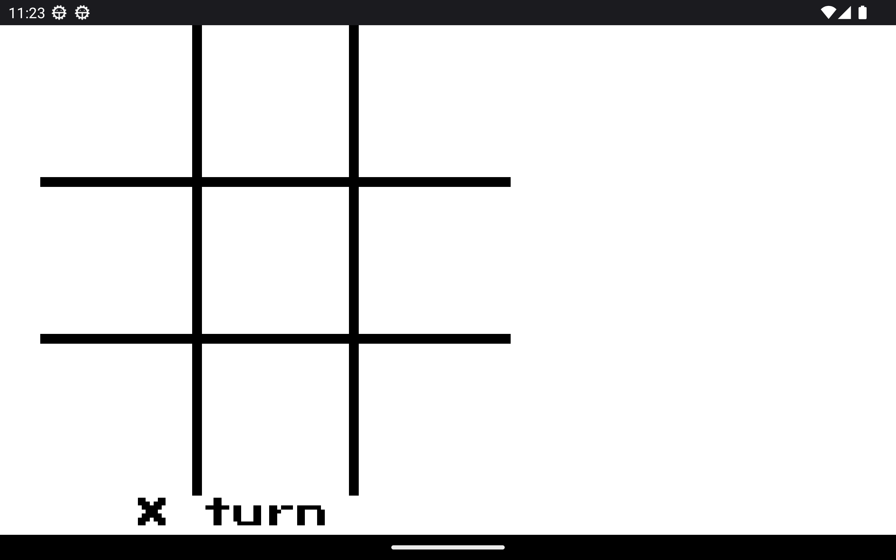

# The Old Ladies

## Description
The Old Ladies is a tic-tac-toe game developed using MonoGame. It is a classic game where two players take turns marking X and O on a 3x3 grid. The objective is to get three of your marks in a row, either horizontally, vertically, or diagonally.

## Features
- Play against a friend or against the computer
- Multiple difficulty levels for the AI opponent
- Cross-platform support: available for Windows, Linux, Mac, and Android

## Installation
1. Clone the repository: `git clone https://github.com/wolfpackgames/theoldladies.git`
2. Open the project in your preferred IDE or text editor
3. Build and run the game

## Usage
- Use the mouse or touch input to select a cell on the game board
- Take turns with your opponent to place your mark (X or O) on the selected cell
- The game will automatically determine the winner or declare a draw

## Download
You can download the latest version of The Old Ladies for your platform from the following links:

- [Windows](https://example.com/TheOldLadies/Windows/TheOldLadies.exe)
- [Linux](https://example.com/TheOldLadies/Linux/TheOldLadies.AppImage)
- [Mac](https://example.com/TheOldLadies/Mac/TheOldLadies.dmg)
- [Android](https://play.google.com/store/apps/details?id=com.example.theoldladies)

## License
The Old Ladies is released under the [MIT License](LICENSE), which is one of the most permissive open source licenses available. This means that you are free to use, modify, and distribute the game as long as you include the original license and copyright notice.

## Contributing
Contributions are welcome! If you would like to contribute to The Old Ladies, please follow the guidelines in [CONTRIBUTING.md](CONTRIBUTING.md). We appreciate any bug reports, feature requests, or pull requests.

## Contact
If you have any questions or need support, please feel free to contact us at [paulushc@gmail.com](mailto:paulushc@gmail.com). We would be happy to assist you.

## Acknowledgements
We would like to thank the following individuals and projects for their contributions to The Old Ladies:

- [MonoGame](https://www.monogame.net/) - The framework used to develop the game
- [OpenGameArt](https://opengameart.org/) - The source of the game assets
- [Font Awesome](https://fontawesome.com/) - The icons used in the user interface

## Screenshots
Here are some screenshots of The Old Ladies in action:

